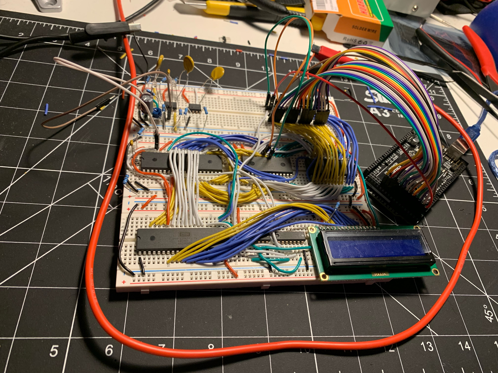

# py-zero-two

A 6502 assembler targeted at the wd65c02, written in python. Inspired by Ben Eater's DIY 6502 project. My end goal for this is to have a toolchain capable of assembling any program written in 6502 assembly and writing it to Ben Eater's DIY 6502, with an eventual, optimized port to a more efficient language like C.

## assembler usage
```
python assembler.py assembly_code.s raw_binary.bin
```

## eeprom-programmer
A tool for programming the EEPROM. Targeted at the Arduino MEGA 2560, but can easily be ported to an Arduino compatible dev board with fewer digital outputs via shift registers.

### eeprom-programmer usage
The EEPROM programmer works via two scripts running simultaneously: serial-send.py sequentially sends each byte of the assembled, raw binary to the specified serial port and the eeprom-programmer.ino runs on the Arduino and listens for each individual byte to write to the EEPROM.

Usage for serial-send.py:
```
python serial-send.py raw_binary.bin [serial port]
```

eeprom-programmer.ino should be running and listening for bytes on the serial port *before* starting serial-send.py. 

## the physical build
In circuit EEPROM flashing and bus debugging has been implemented!


